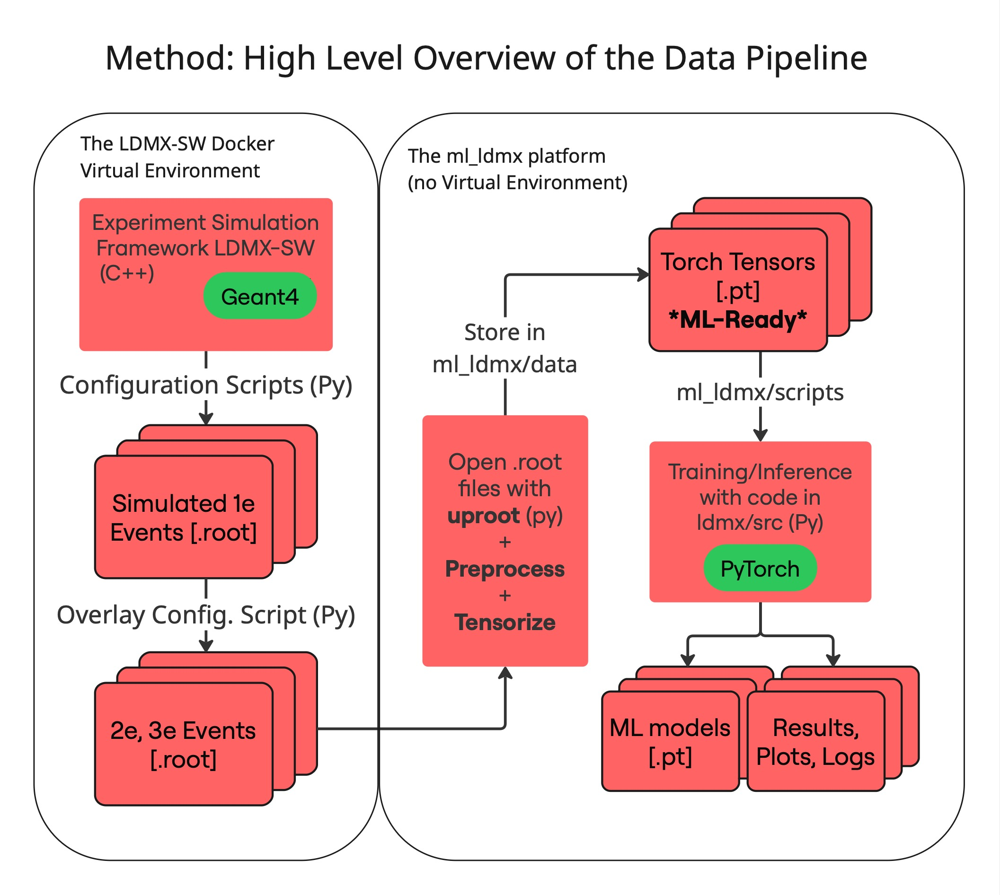

# ml_ldmx

Machine-learning prototypes for LDMX event reconstruction, currently focused on
assigning ECal RecHits to incoming electrons using ECal information together
with TriggerPadTracks context. The newer pipelines are MLPF-inspired
transformer models that operate on variable-length event tokens.



## Current Focus

The active ECal/TriggerPad workflow reads ROOT events, builds per-event tensor
representations, trains hit-level prediction heads, and saves metrics,
checkpoints, and diagnostic plots.

Each context-aware event uses an 8-column node feature layout:

```text
[is_ecal, is_tpad, ecal_x, ecal_y, ecal_z, ecal_energy, tpad_centroid, tpad_pe]
```

`ecal_energy` is the reconstructed ECal RecHit energy input and `tpad_pe` is
the TriggerPadTracks photoelectron input. They are stored raw by default in the
Python CLIs; pass `--ecal-energy-transform log1p --tpad-pe-transform log1p`
during ROOT preprocessing or ROOT-backed cache creation to store
`log1p(max(value, 0))` instead. The truth deposited-energy fraction targets are
not log-transformed.

ECal nodes receive supervised targets; TriggerPadTracks nodes provide context.
The default target mode is `canonical-y`, which orders electron targets by
their spatial position in each event instead of relying on arbitrary physical
origin IDs.

Maintained training entry points are:

- `scripts/train_hit_classifier_baseline.py`: common canonical-y runner for
  the four maintained hit-origin classification baselines.
- `scripts/train_ecal_tpad_slot_model.py`: balanced `2e`/`3e` training with
  hit-origin, energy-fraction, slot-validity, and event electron-count heads.
- `scripts/train_ecal_tpad_mlpf_lite_scaled.py`: scalable three-origin
  hit/fraction training on a configurable ROOT subset, with reusable tensor
  caches.

## Setup

Run commands from this `ml_ldmx/` directory unless stated otherwise.

```powershell
cd ml_ldmx
python -m pip install -e .
```

`pyproject.toml` currently installs the local package only; it does not declare
runtime dependencies. The working environment must already provide the
scientific/ML stack used by the scripts, including PyTorch, PyTorch Geometric,
uproot, awkward, NumPy, and Matplotlib.

## Quick Start

This walkthrough takes one labelled pile-up `events.root` file through
preprocessing, tensorisation, `ECalTpadTransformer` training, and result
inspection. It assumes the file contains ECal RecHits, TriggerPadTracks, truth
information for physical origins `1`, `2`, and `3`, and at least 20 events.

### 1. Choose the input and output paths

Set these once in the shell from `ml_ldmx/`:

```bash
ROOT_FILE=/absolute/path/to/pile-up/events.root
PROCESSED_DIR=data/processed/pileup_quickstart
RUN_DIR=outputs/hit_classifier_baseline/ecaltpad_quickstart
```

### 2. Preprocess and tensorise the ROOT events

```bash
python scripts/preprocess_ecal_tpad_dataset.py \
  --root-file "$ROOT_FILE" \
  --output-dir "$PROCESSED_DIR" \
  --max-events 1000 \
  --ecal-energy-transform log1p \
  --tpad-pe-transform log1p \
  --no-edge-index
```

This filters noise hits, applies `log1p` to the ECal energy and TriggerPad
photoelectron inputs, and writes one `event_*.pt` tensor file per event plus a
`manifest.json`. `--no-edge-index` avoids building graph edges that the
Transformer does not use. Remove `--max-events 1000` to process the entire
file.

Check that the cache was created:

```bash
ls "$PROCESSED_DIR"
```

### 3. Train the baseline Transformer

```bash
python scripts/train_hit_classifier_baseline.py \
  --model ECalTpadTransformer \
  --processed-dir "$PROCESSED_DIR" \
  --ecal-energy-transform log1p \
  --tpad-pe-transform log1p \
  --epochs 5 \
  --batch-size 8 \
  --device auto \
  --run-name ecaltpad_quickstart
```

The preprocessing options must match those recorded in the cache manifest.
The trainer makes a deterministic 80/15/5 train/validation/test split, fits
continuous-feature normalization only on the training split, and saves the
complete run under `$RUN_DIR`. Use `--device cuda`, `mps`, or `cpu` to select
a device explicitly.

The run already includes training curves, validation diagnostics, a test
confusion matrix, representative event plots, metrics, and checkpoints. The
most useful files to start with are:

```text
accuracy_history.png
loss_history.png
val_event_accuracy_overview.png
val_event_diagnostic_correlations.png
test_hit_origin_confusion_matrix.png
final_metrics.json
checkpoints/best.pt
```

### 4. Generate a best-checkpoint analysis bundle

Use the saved validation-selected checkpoint to generate plots, per-event CSV
and JSON metrics, and interactive worst/median/best event displays:

```bash
python scripts/inspect_hit_classifier_run.py \
  --run-dir "$RUN_DIR" \
  --checkpoint best.pt \
  --split test \
  --num-events 9 \
  --device auto
```

The new files are written to:

```text
outputs/hit_classifier_baseline/ecaltpad_quickstart/inspection/best/test/
```

Run the same command with `--split val` for validation analysis. To inspect a
large split quickly, add `--max-inspection-events 1000`.

### 5. View the results

List every static plot and interactive display:

```bash
find "$RUN_DIR" -type f \( -name '*.png' -o -name '*.html' \) | sort
```

PNG files open in any image viewer. To browse all outputs, including the
interactive HTML event displays, serve the run directory locally:

```bash
python -m http.server 8000 --directory "$RUN_DIR"
```

Open [http://localhost:8000](http://localhost:8000) in a browser and stop the
server with `Ctrl-C`.

## Project Layout

```text
ml_ldmx/
  data/
    ldmx_overlay_events_700k/   Example ROOT input layout
    processed/                  Reusable tensor caches
  outputs/                      Training runs, checkpoints, metrics, and plots
  scripts/
    preprocess_ecal_tpad_dataset.py
                                Single-events.root preprocessing
    preprocess_ecal_tpad_sharded.py
                                Scalable multi-file preprocessing
    train_hit_classifier_baseline.py
                                Maintained baseline model runner
    inspect_hit_classifier_run.py
                                Saved-checkpoint diagnostics and event displays
    analyze_hit_classifier_ceiling.py
                                Assignment-ceiling and TPad-ablation analysis
    compare_hit_classifier_runs.py
                                Paired comparison of trained baselines
    sbatch/                     Cluster preprocessing and training jobs
  src/ml_ldmx/
    io/                         ROOT readers and artifact writers
    datasets/                   Tensorisation, preprocessing, and cached datasets
    models/                     Transformer and graph-network architectures
    train/                      Training loops, losses, splits, and checkpoints
    eval/                       Evaluation and event diagnostics
    viz/                        Static and interactive plotting
  tests/                        Unit and smoke regression tests
```

## Larger Workflows

The quick start uses one tensor file per event because it is easy to inspect.
For large datasets, use `scripts/preprocess_ecal_tpad_sharded.py`; it writes
one tensor shard per source ROOT file and can resume incomplete preprocessing.

- [`SUPERVISOR_DEMO.md`](SUPERVISOR_DEMO.md) reproduces the complete 20,000-event
  Transformer demonstration and its inspection bundles.
- [`docs/cosmos_training.md`](docs/cosmos_training.md) covers sharded
  preprocessing and GPU training on the Cosmos cluster.
- `python scripts/train_hit_classifier_baseline.py --help` lists the supported
  baselines and all data, model, checkpoint, and device options.
